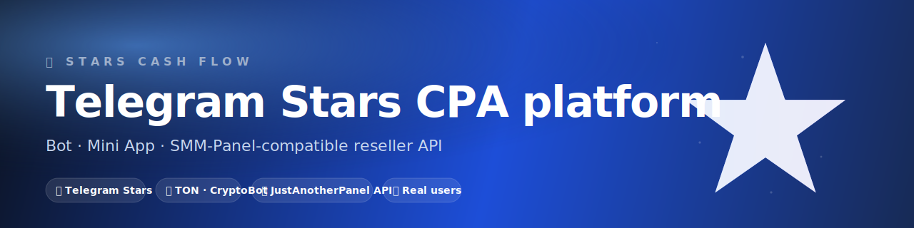
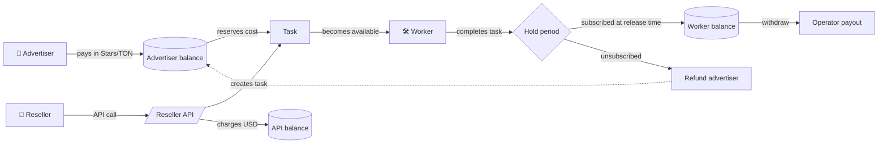

<div align="center">

<a href="https://stars.ros.media">
  
</a>

# ✨ Stars Cash Flow

**Telegram Stars CPA platform — a bot, a Mini App and a reseller API built around the Telegram Stars payment stack.**

[Bot](https://t.me/StarsCashFlowbot) · [Mini App](https://t.me/StarsCashFlowbot/app) · [Landing](https://stars.ros.media) · [Reseller API](https://api-stars.ros.media) · [Docs](docs/)

[](https://t.me/StarsCashFlowbot)
[](https://t.me/StarsCashFlowbot/app)
[](https://stars.ros.media)
[](https://api-stars.ros.media)
[](LICENSE)
[](https://python.org)
[](https://aiogram.dev)
[](https://github.com/Open-Source-Studio/stars-cash-flow)

</div>

---

## What it is

A Telegram-native **CPA platform** built around the real Telegram Stars economy:

- 📣 **Advertisers** create tasks (channel subscribe / boost / bot start) and pay rewards in Telegram **Stars** or **TON**.
- 🛠 **Workers** execute tasks inside Telegram and earn the reward, withdrawn to their Telegram account (Stars) or TON wallet.
- 🔌 **Resellers** integrate over a standard SMM-Panel-compatible HTTP API — drop-in compatible with the **JustAnotherPanel / SocPanel / AliPanel** call signature.

The platform owns the worker pool, anti-cheat (hold periods + subscription re-checks), and the billing rails. **Real users**, **transparent pricing**, **no synthetic followers**.

> **This repository** holds the public documentation, integration guides and examples. Production code is proprietary.

---

## Table of contents

- [Entry points](#entry-points)
- [Quickstart for resellers](#quickstart-for-resellers)
- [How the money flows](#how-the-money-flows)
- [Architecture](#architecture)
- [Pricing](#pricing)
- [Documentation](#documentation)
- [Status & roadmap](#status--roadmap)
- [Community & support](#community--support)
- [License](#license)

---

## Entry points

| Where | What |
|---|---|
| 💬 **Bot** | [@StarsCashFlowbot](https://t.me/StarsCashFlowbot) — full UI for advertisers and workers, deposits / withdrawals, task management. |
| 📱 **Mini App** | [t.me/StarsCashFlowbot/app](https://t.me/StarsCashFlowbot/app) — same product as a Telegram Web App: balance, KPI, staking, giveaways. Native haptics, Telegram BackButton on every sheet. |
| 🖥 **Web cabinet** | [api-stars.ros.media/app](https://api-stars.ros.media/app) — browser cabinet with Telegram Login, order history. |
| 🔌 **Reseller API** | [api-stars.ros.media/api](https://api-stars.ros.media/api) — SMM-Panel-compatible JSON API. See [docs/api.md](docs/api.md). |
| 🌐 **Site** | [stars.ros.media](https://stars.ros.media) — public landing with FAQ and pricing. |

---

## Quickstart for resellers

If you're already pushing traffic into **JustAnotherPanel** / **SocPanel** / **AliPanel** — swap the URL and the `key`, leave the rest of your integration unchanged:

```bash
# 1. Inspect the catalog (no key needed)
curl "https://api-stars.ros.media/api?action=services"

# 2. Check your balance
curl -X POST https://api-stars.ros.media/api \
  -d "key=YOUR_API_KEY" -d "action=balance"
# → {"balance": "10.5000", "currency": "USD"}

# 3. Create an order
curl -X POST https://api-stars.ros.media/api \
  -d "key=YOUR_API_KEY" \
  -d "action=add" \
  -d "service=1" \
  -d "link=https://t.me/your_channel" \
  -d "quantity=500"
# → {"order": 12345}

# 4. Poll status
curl "https://api-stars.ros.media/api?action=status&key=YOUR_API_KEY&order=12345"
# → {"charge": "10.00", "start_count": "0",
#    "status": "In progress", "remains": "500", "currency": "USD"}
```

Python and shell examples in [`examples/`](examples/). Full API reference in [`docs/api.md`](docs/api.md).

---

## How the money flows



- **21-day hold** on Stars rewards (Telegram-side anti-fraud rule).
- **48-hour hold** on TON rewards (anti-chargeback default).
- **Subscription re-check** before paying the worker — leave the channel, lose the reward, advertiser gets refunded.
- **Atomic balance changes** at every step (no double-spend, no negative balances at the SQL layer).

---

## Architecture

<div align="center">
  
</div>

- **Python 3.11+** with `asyncio` end-to-end.
- **aiogram 3.x** for the Telegram bot dispatcher.
- **aiohttp** for the HTTP API server (shares the event loop with aiogram).
- **aiosqlite** — single SQLite file under `/data/` (Coolify persistent volume), all writes wrapped in `BEGIN IMMEDIATE`.
- **Vanilla HTML + Tabler** for the admin panel — no build step, served from the same process.
- **Coolify + Traefik + Let's Encrypt** for deployment and TLS.

Full deep-dive in [`docs/architecture.md`](docs/architecture.md).

---

## Pricing

Two layers, both transparent:

1. **Formula-based** for task-exchange services:
   ```
   rate_usd_per_1000 = reward_stars × (1 + platform_fee/100) × USD_PER_STAR × 1000
   ```
   Today (`USD_PER_STAR=0.020`, `PLATFORM_FEE_PERCENT=25`):
   | Service | Reseller pays |
   |---|---|
   | Channel subscribers (task exchange) | **$25 / 1000** |
   | Channel boosts (task exchange) | **$50 / 1000** |
   | Bot starts (task exchange) | **$25 / 1000** |

2. **Operator-set** for manually fulfilled services (Stars Transfer, Premium Mix, RU/Global subscribers, Premium Boosts). Live numbers in [`docs/pricing.md`](docs/pricing.md) and always at [`/api?action=services`](https://api-stars.ros.media/api?action=services).

**Withdrawals**: 0% fee, min 1000 ⭐ or 5 💎 TON.

---

## Documentation

| Doc | What |
|---|---|
| [`docs/api.md`](docs/api.md) | Reseller API reference — actions, params, response shapes, errors, rate limits. |
| [`docs/bot.md`](docs/bot.md) | End-user guide for advertisers and workers (commands, deposit flows, withdrawal). |
| [`docs/miniapp.md`](docs/miniapp.md) | Mini App feature tour and Telegram WebApp integration notes. |
| [`docs/pricing.md`](docs/pricing.md) | Pricing model, conversions (Stars ↔ USD), refunds. |
| [`docs/architecture.md`](docs/architecture.md) | High-level architecture, components, lifecycle of a task, hold mechanics. |
| [`SECURITY.md`](SECURITY.md) | Responsible disclosure policy. |
| [`CHANGELOG.md`](CHANGELOG.md) | Release notes. |

The project also has a [GitHub Wiki](https://github.com/Open-Source-Studio/stars-cash-flow/wiki) with a long-form FAQ and integration recipes.

---

## Status & roadmap

| Component | State |
|---|---|
| Telegram bot | ✅ Production |
| Mini App | ✅ Production (Tier-1: haptic, native BackButton, onboarding, pull-to-refresh) |
| Web cabinet | ✅ Production |
| Reseller API | ✅ Production — services, balance, add, status, cancel |
| TON Connect | ✅ Manifest live |
| Stars deposits | ✅ Telegram Stars native |
| TON deposits | ✅ via CryptoBot |
| Card / fiat top-ups | 🚧 Routes ready, providers pending integration |
| Refill API action | ⏳ Planned |
| Drip-feed `add` params | ⏳ Planned |

---

## Community & support

- **General questions / business**: write to [@StarsCashFlowbot](https://t.me/StarsCashFlowbot) → "Поддержка / Support".
- **Security**: see [SECURITY.md](SECURITY.md).
- **Bug reports / feature requests for the public docs and examples**: open an issue or a pull request in this repo.
- **Issues and discussions** are open — drop a question if something in the API or docs is unclear.

If this project is useful to you — please ⭐ the repo, it helps others find it.

---

## License

[MIT](LICENSE) — public docs and example code.
The platform's production code is proprietary and lives elsewhere.

---

<div align="center">
<sub>Made with ❤️ for the Telegram Stars economy. Brought to you by <a href="https://github.com/Open-Source-Studio">Open Source Studio</a>.</sub>
</div>
