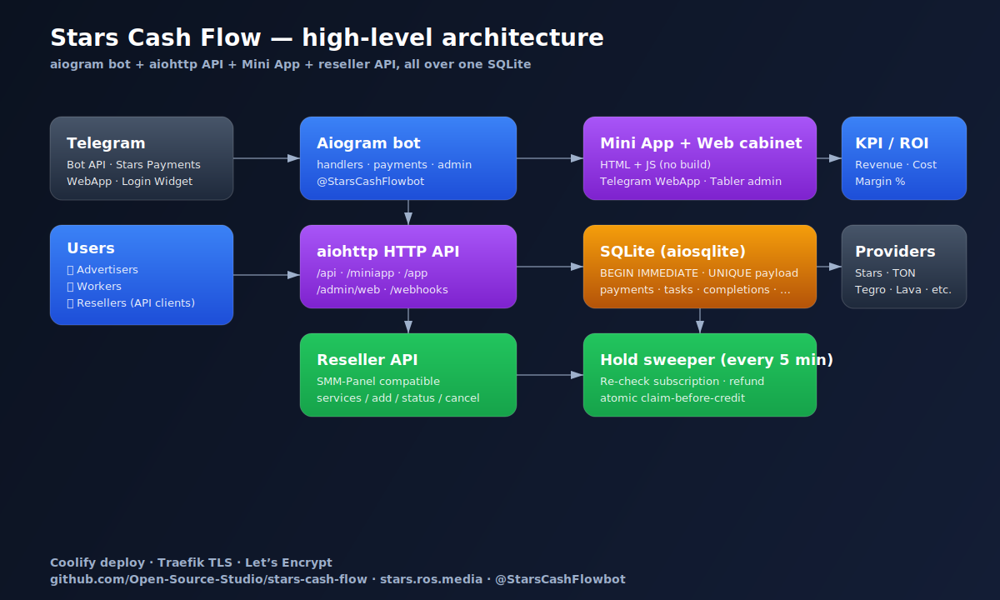
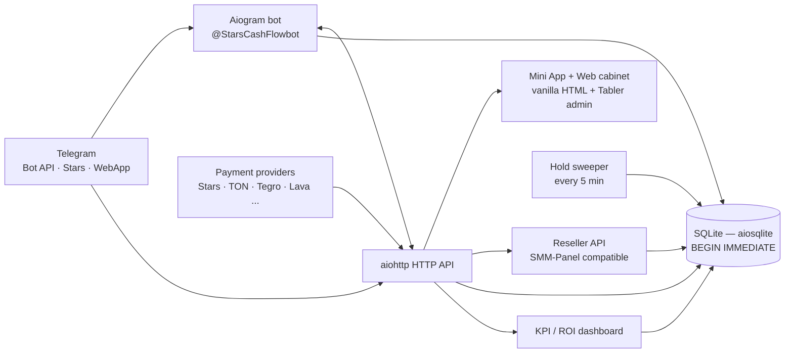
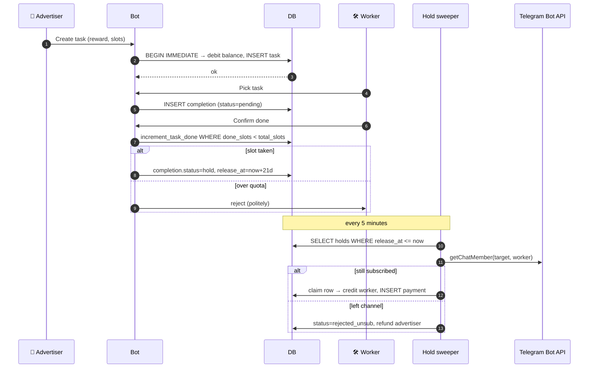

# Architecture

High-level overview of how Stars Cash Flow is put together. No code in this doc — the implementation lives in a private repository.

## Components

## Stack

- **Python 3.11+** (Nixpacks default in Coolify), `asyncio` end-to-end.
- **aiogram 3.x** — bot dispatcher and Telegram Bot API.
- **aiohttp** — HTTP API server (port 8080), shares the event loop with aiogram.
- **aiosqlite** — single SQLite file under `/data/cashstarflow.db` (persistent Coolify volume). All writes wrapped in `BEGIN IMMEDIATE` to keep advisory-lock semantics under concurrent updates.
- **Vanilla HTML + CSS + JS** for Mini App and admin panel — no frontend build. Admin panel is skinned with [Tabler](https://tabler.io/) via CDN.

## Lifecycle of a task-exchange order — sequence

## Steps in detail

1. **Advertiser** creates the task → balance is debited atomically (`UPDATE … WHERE balance >= cost`) and a `tasks` row is inserted in the same transaction.
2. **Worker** picks the task from the available list (filtered by eligibility, premium gate, anti-cheat history).
3. Worker confirms completion → `completions` row created.
4. `increment_task_done` runs atomically with a `WHERE done_slots < total_slots` guard. If the slot was the last one, the task flips to `completed`. Workers who race past the quota are politely rejected.
5. `pay_worker` writes the reward into the `completions` row as `status='hold'` and sets `release_at = now + STARS_HOLD_SECONDS` (21 days). Referral bonuses are credited immediately (no hold).
6. The hold sweeper runs every 5 minutes:
   - For `type='subscribe'` it calls `bot.get_chat_member(target, worker_id)` to confirm the worker is still in the channel. If they left — the completion flips to `rejected_unsub` and the advertiser is refunded.
   - Otherwise, the row is atomically claimed (`UPDATE … WHERE status='hold'`) and the worker balance is credited. The `payments` row uses a unique `hold_release_<id>` payload so re-runs are idempotent.

## Money safety invariants

- **One transaction = one balance change.** Every debit / credit lives inside a `BEGIN IMMEDIATE` block.
- **Conditional UPDATEs guard balances.** A negative delta uses `WHERE balance >= -delta` — overdraft is impossible at the SQL layer.
- **Idempotent payments.** `payments.payload` has a `UNIQUE` constraint; replayed webhooks no-op.
- **Cancel + refund** for advertiser-side tasks returns `remaining × reward × (1 + fee/100)` atomically.
- **Unique invoice payloads** for Telegram Stars top-ups (nonce per invoice) so duplicate same-amount top-ups never collide on the `UNIQUE` constraint.

## Sessions and auth

- **Bot context** — Telegram identity from updates, trusted via Bot API.
- **Mini App** — HMAC-verified `initData` with 24h freshness. Every financial endpoint re-validates on each call.
- **Web cabinet** — Telegram Login Widget, cookie-based session backed by SQLite (`web_sessions` table), CSRF tokens issued per session and validated on POST.
- **Admin panel** — `API_ADMIN_SECRET` for first login, then session cookie with `samesite=Strict`. Brute-force lockout (5 fails / 5 min → 429).

## Payment rails

- **Telegram Stars** native (`successful_payment` update).
- **TON** via CryptoBot polling (`@CryptoBot`).
- **Cards / RU fiat**: webhook routes ready for Tegro.Money, Lava.ru, UnitPay and Heleket. Each verifies the provider's signature, dedupes via `payments.payload`, returns HTTP 200 on already-seen events.

## Observability

- Structured logs via `logging.basicConfig`.
- Optional Sentry — set `SENTRY_DSN` in env, no-op otherwise.
- KPI dashboard at `/admin/web/kpi` aggregates revenue / cost / margin by period directly from the same SQLite — no external analytics needed.

## Deployment

- **Coolify** on a Hetzner / Fornex VPS, auto-deploy from `main` branch.
- **Build:** Nixpacks (Python 3.11+ auto-detected via `requirements.txt`).
- **Health probes:** `GET /health` and `/healthz`.
- **Persistent volume:** `/data` for the SQLite file.
- **TLS:** Traefik (Let's Encrypt). `APP_PUBLIC_BASE_URL` env is required so server-rendered URLs use `https://`.
